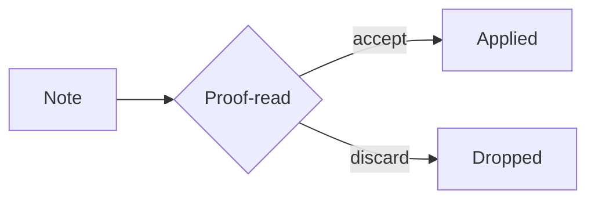

# Markdown Elements

A single note that exercises every Markdown construct the plugin has to survive:
headings for the heading stack, tables and code blocks for the correction pass
exclusions, and inline constructs for the masking round-trip.

## Headings

# Heading level 1
## Heading level 2
### Heading level 3
#### Heading level 4
##### Heading level 5
###### Heading level 6

Setext style also renders as a heading:

Alternative level 1
===================

Alternative level 2
-------------------

## Paragraphs and line breaks

A paragraph is one or more lines of text separated from the next block by a
blank line. Soft wraps inside a paragraph collapse into a single line when the
note is rendered.

This line ends with two trailing spaces,  
so the break is kept as a hard line break.

A backslash at the end of a line does the same thing\
in most Markdown flavours.

## Emphasis

*Italic with asterisks* and _italic with underscores_.
**Bold with asterisks** and __bold with underscores__.
***Bold italic*** and ~~strikethrough~~.
==Highlighted text== renders as a mark in Obsidian.
Subscript H<sub>2</sub>O and superscript E = mc<sup>2</sup> need inline HTML.

## Lists

### Unordered

- First item
- Second item
  - Nested item
  - Another nested item
    - Third level
- Third item

* Asterisk marker
+ Plus marker

### Ordered

1. First step
2. Second step
   1. Sub-step one
   2. Sub-step two
3. Third step

Numbers do not have to be sequential in the source:

1. Renders as 1
1. Renders as 2
1. Renders as 3

### Task list

- [x] Write the sample note
- [ ] Run it through the proof-read sidebar
- [ ] Check the heading stack overlay
  - [ ] Scroll past a level 3 heading

### Definition list

Term
: The definition, indented with a colon. Supported by some renderers only.

Glossary
: A note carrying `schreibstubeGlossary: true` in its frontmatter.

## Blockquotes

> A plain blockquote.
>
> Second paragraph inside the same quote.

> Nesting works too:
>
> > The inner quote sits one level deeper.
> >
> > — attribution line

> A quote can contain other blocks:
>
> 1. A list
> 2. Another entry
>
> ```ts
> const quoted = true;
> ```

### Callouts

> [!note]
> Obsidian callouts are blockquotes with a type marker.

> [!warning] Custom title
> The correction pass leaves fenced code, tables and math untouched.

> [!tip]- Collapsed by default
> A trailing minus folds the callout on open.

## Code

Inline `code` stays masked while the note is sent for correction, and so does
`inline code with **markup** inside`.

```ts
export function greet(name: string): string {
  return `Hello, ${name}`;
}
```

```bash
npm run build
```

```
A fence without a language hint.
```

    An indented code block, four spaces deep.
    Second line.

## Tables

| Element | Syntax | Excluded from correction |
|---|---|---|
| Heading | `# Title` | no |
| Table | pipes | yes |
| Code block | backtick fence | yes |
| Math block | `$$ … $$` | yes |

Alignment is set by the colons in the delimiter row:

| Left | Center | Right |
|:---|:---:|---:|
| a | b | 1 |
| longer cell | centred | 42 |
| c | d | 1000 |

## Links and references

An [inline link](https://example.com) and one [with a title](https://example.com "Example Domain").

A [reference link][ref] resolves at the bottom of the note.

A bare URL: <https://example.com>.

An internal [[Wikilink]] and one [[Wikilink|with an alias]].

A block embed: ![[Another Note#Section]].

[ref]: https://example.com/reference "Reference target"

## Images


![[embedded-image.png]]

## Footnotes

Text carrying a footnote.[^1] A second reference points elsewhere.[^note]

[^1]: The footnote body.
[^note]: A named footnote, which may span
    several indented lines.

## Horizontal rules

---

***

___

## Math

Inline math such as $E = mc^2$ sits in the flow of the sentence.

$$
\int_{0}^{\infty} e^{-x^2}\,dx = \frac{\sqrt{\pi}}{2}
$$

## Diagrams



## Inline HTML

<div align="center">
  <strong>Centred block</strong> built from raw HTML.
</div>

An abbreviation: <abbr title="Terminology Base eXchange">TBX</abbr>.

<details>
<summary>A collapsible section</summary>

Hidden until the summary is clicked.

</details>

## Tags and metadata

Inline tags such as #markdown and #sample are masked before the text is sent
for correction and restored afterwards.

## Escaping

Backslashes turn a construct back into literal text: \*not italic\*,
\# not a heading, and \[not a link\](nowhere).

Literal backticks go inside a longer fence: `` ` `` and ``code with ` inside``.

## Comments

%% An Obsidian comment; it never renders. %%

<!-- An HTML comment; it never renders either. -->
